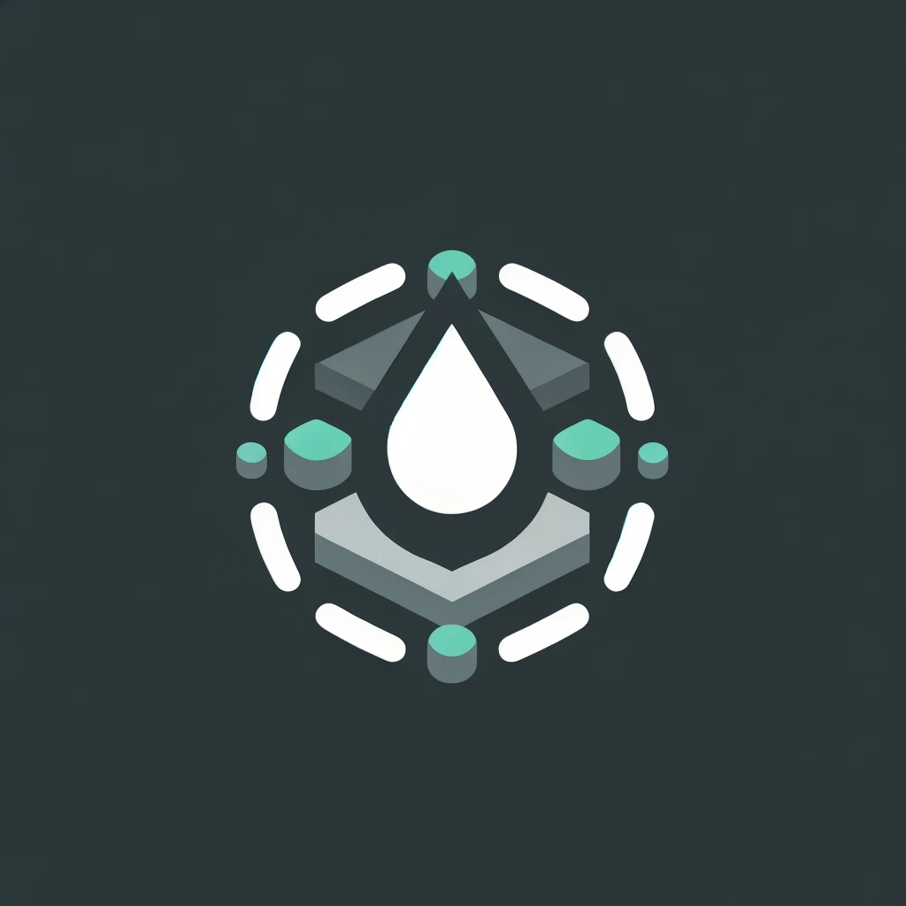

# <p style="text-align: center;"> Decentralized Exchange (DEX) on Substrate FRAME </p>

## Overview

Our Decentralized Exchange (DEX) built on Substrate FRAME is a groundbreaking platform designed to revolutionize the way
assets are exchanged in the digital space. Utilizing the robust and flexible architecture of Substrate FRAME, our DEX
offers a trustless and decentralized environment for trading multiple assets. It's inspired by the pioneering model of
Uniswap V2 and introduces the concept of liquidity pools, a novel approach to facilitate asset exchange without
traditional order books.

### Background and Considerations

In traditional exchanges, trades occur directly between buyers and sellers, often requiring an intermediary or matching
orders in an order book. Our DEX eliminates these requirements by introducing liquidity pools. These are essentially
reservoirs of two assets, between which users can trade. Users can also contribute to these pools, thus providing
liquidity, and in return, they receive incentives.

Our DEX is designed to be trustless and transparent, ensuring users have full control over their assets without the need
for a central authority. This approach not only enhances security but also ensures uninterrupted trading, even in
volatile market conditions.

### State Transition Function Design

Our DEX operates on a set of well-defined state transition functions. These functions govern how the states change in
response to various actions like adding or removing liquidity, performing swaps, etc.

#### Adding Liquidity:

- Users can become liquidity providers by depositing an equal value of two tokens in a pool.
- The state of the pool is updated to reflect these new reserves.
- This process democratizes market making and offers users a share in transaction fees.

#### Token Issuance:

- In return for providing liquidity, users receive Liquidity Provider (LP) tokens.
- These tokens are a representation of their share in the pool.
- LP tokens can be redeemed later to withdraw a proportional share of the pool's assets, including a portion of the
  transaction fees.

#### Swap Mechanism:

- Our DEX utilizes the constant product formula `(x * y = k)` to facilitate token swaps within a pool.
- This formula ensures price stability and prevents large orders from drastically changing the price.

#### Fees and Rewards:

- A nominal fee (e.g., 0.3%) is levied on swaps and added to the pool’s reserves.
- Liquidity providers benefit as the value of LP tokens increases with the accumulation of fees.

#### Removing Liquidity:

- Liquidity providers can withdraw their share from the pool by burning their LP tokens.
- The withdrawal includes their share of the assets and a portion of the accumulated fees.

#### Resource Links:

For a more visual understanding of these concepts, consider these informative resources:

- [Liquidity Pools Explained](https://www.youtube.com/watch?v=dVJzcFDo498)
- [Understanding Automated Market Making](https://www.youtube.com/watch?v=1PbZMudPP5E)

To get a detailed understanding of the spec, please review and run the [tests](/pallets/dex/src/tests.rs)

```shell
cargo test -p pallet-dex 
```

### Compromises and Future Improvements

- The current design uses generic pallet types for flexibility, but this approach has limitations in ordering asset IDs,
  affecting the uniqueness of LP token IDs. We are exploring solutions to allow automatic generation of unique LP token
  IDs, enhancing user convenience.

## Running the Project

### Development Testing

Rapid testing during development is streamlined through:

```shell
cargo t -p pallet-dex
```

### Build

To build the node without launching it, optimized for release:

```shell
cargo b -r
```

### Run

To build and launch the node, optimized for release:

```shell
cargo r -r -- --dev
```

### CLI Docs

Explore all CLI arguments and subcommands post-build:

```shell
./target/release/node-template -h
```

### Interaction

Interaction with the DEX is primarily through [Polkadot JS Apps](https://polkadot.js.org/apps/), with plans for a
dedicated frontend interface for an enhanced user experience.

### Workflow:

This section outlines the typical workflow for users interacting with the DEX, starting from the initial setup to
various trading activities.

- **Pre-configured Genesis Data**: The blockchain is initialized with pre-configured genesis data, which includes a set
  of assets allocated to initial users - `Alice`, `Bob`, and `Charlie`. Additionally, a DEX account is set up, serving
  as the central node for various DEX operations.

1) **Create Pool**:
    - Users can initialize liquidity pools by pairing two different types of assets.
    - This action is crucial for setting up trading avenues on the DEX.
    - It lays the foundation for a decentralized marketplace where various asset pairs can be traded.

2) **Provide Liquidity**:
    - Users contribute to liquidity pools by depositing equal values of the asset pairs.
    - By providing liquidity, they facilitate seamless asset swaps on the platform.
    - In return, they receive Liquidity Provider (LP) tokens, representing their share of the pool and a claim on a
      portion of the trading fees.

3) **Remove Liquidity**:
    - Liquidity providers can decide to withdraw their contribution from the pool.
    - Upon withdrawal, their LP tokens are burned, and they receive their share of the pool's assets back.
    - This process also includes a proportionate share of the accumulated transaction fees, thus incentivizing liquidity
      provision.

4) **Swap Tokens**:
    - Users can swap one type of asset for another using the established liquidity pools.
    - The swap rates are determined algorithmically, based on the pool's current state, ensuring fair and transparent
      pricing.

5) **Set Swap Limits**:
    - To mitigate risks associated with price fluctuations during a swap, users can set limits on the swap amounts.
    - This includes setting maximum limits on the amount given or minimum limits on the amount received.
    - This feature adds an extra layer of control for users, enhancing their trading strategy.

6) **Price Oracle Access**:
    - The DEX provides an API for accessing real-time pricing information.
    - This feature is crucial for users who need up-to-date pricing data for trading decisions or for external
      applications leveraging DEX data.
    - The pricing is derived from the latest state of the liquidity pools, reflecting the current market dynamics.

Each of these steps contributes to a robust and fluid trading ecosystem, catering to both casual traders and liquidity
providers.

## Future Plans: Supporting Multi-Pool Swaps

### Introduction to Multi-Pool Swaps

As part of our ongoing efforts to enhance our DEX's functionality and user experience, one of our key future
developments is the implementation of multi-pool swaps. This feature will allow users to execute trades across multiple
liquidity pools in a single transaction, providing greater flexibility and potentially better trading opportunities.

### Benefits of Multi-Pool Swaps

1. **Optimized Trade Execution**: Multi-pool swaps can offer users more favorable exchange rates compared to single-pool
   swaps. By routing through multiple pools, trades can minimize slippage, especially for large orders.

2. **Increased Liquidity Access**: This feature taps into the liquidity of multiple pools, reducing the impact of large
   trades on any single pool's liquidity and price.

3. **Enhanced Trading Opportunities**: Users can leverage price disparities across different pools, enabling arbitrage
   opportunities within the ecosystem.

4. **Greater Asset Reach**: Multi-pool swapping extends the range of accessible assets, as users can trade across pools
   that individually might not support direct swaps between certain assets.

### Implementation Considerations

1. **Pathfinding Algorithms**: Implementing efficient algorithms to find the best swapping routes across multiple pools
   is crucial. These algorithms must balance optimization for best rates with computational efficiency to ensure timely
   trade execution.
   Following is an outline of how that might work:

```rust
    fn new(pools: Vec<LiquidityPool>) -> Self {
    let mut graph = Graph { edges: HashMap::new() };
    for pool in pools {
        let weight = calculate_weight(&pool);
        graph.add_edge(pool.asset1, Edge { to: pool.asset2, weight });
        graph.add_edge(pool.asset2, Edge { to: pool.asset1, weight });
    }
    graph
}

impl Graph {
    fn add_edge(&mut self, from: AssetId, edge: Edge) {
        self.edges.entry(from).or_insert_with(Vec::new).push(edge);
    }

    fn find_optimal_path(&self, start: AssetId, end: AssetId) -> Option<Vec<AssetId>> {
        // use https://crates.io/crates/pathfinding 
    }

    fn calculate_weight(pool: &LiquidityPool) -> f64 {
        // based on liquidity depth, arbitrage opportunity, slippage, etc
    }
}
```

2. **Extrinsic weights and Performance**: Multi-pool swaps involve more interactions with the blockchain, potentially
   leading to higher costs. Optimizing on chain efficiency to minimize these costs will be essential.

3. **Off-Chain Computation**: Therefor it is important the computation would be done off chain. The pallet can expose
   the computation logic via an interface or potentially using Frame's RPC support

### Conclusion

The introduction of multi-pool swaps represents a significant stride forward in our DEX's capabilities. By carefully
considering the various technical and user experience aspects of this feature, we could provide our users with a more
powerful, efficient, and versatile trading platform.
This enhancement aligns with our mission to continuously innovate and improve our DEX, ensuring it remains at the
forefront of decentralized trading technology.

